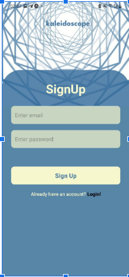
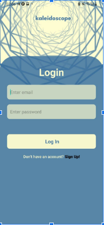
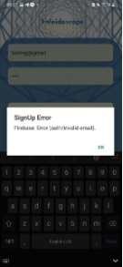
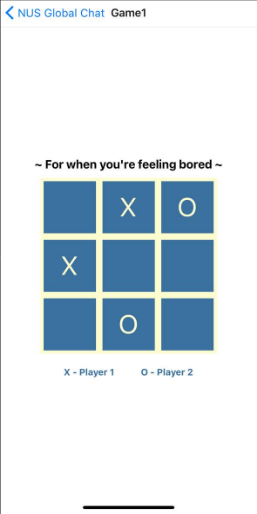
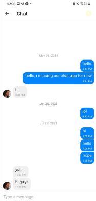
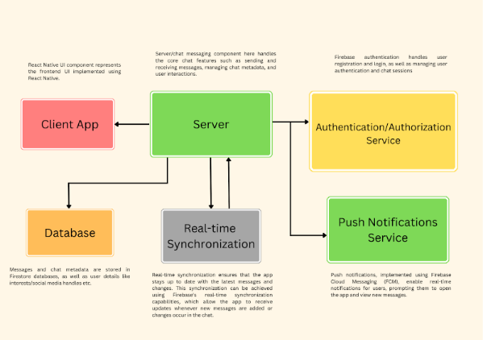
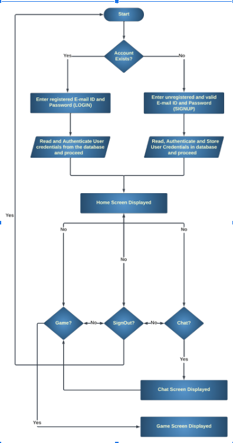
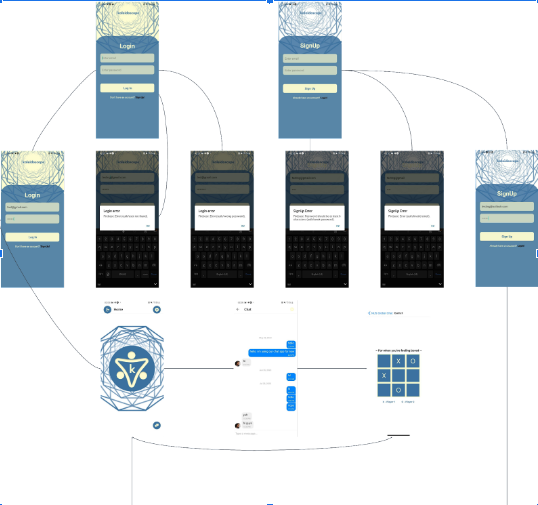
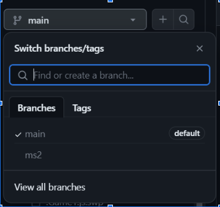
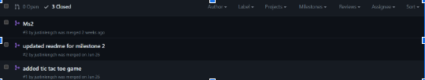

# **nusorbital2023**

# **Milestone 3 Submission**

## **Team Name:**

_yuhSURE_

## **Proposed Level of Achievement:**

_Apollo_

## **Motivation:**

Having been international freshmen this past year, we had known the challenge to put ourselves out there, interact with people and meet new people.

Besides, the initially advertised (in the telegram group chats) Telegram MatchBot to interact with people matched based on our preferences and profiles proved inadequate. It was inconvenient and awkward to use which made experiences with using it very polarised (i.e., it was always either a hit or miss)

Furthermore, one major drawback was the inability to find something in common with a user we are matched with. These limitations had initially outlined the basis of our idea, **_an improved chat app_**.

Besides, we realised that however easy or difficult it might prove to click with people, there is still a huge wall to climb in overcoming the awkwardness that comes with not knowing what to talk about or in waiting for answers to confusions as would entailed by, say, a freshman posing a question and getting restless in waiting for an answer purely out of stress. The wait may be long depending on the willingness of people to answer a query, but with our improved chat app it surely won’t be boring.

Which is why we have further ideated to have features that not only serve the intended purpose of tackling limitations with pre-existing chatbots but also to further add a leisurely element to the chat app.

Additionally,we intend to understand and learn exactly how mobile app development takes place along our development process. We also intend to learn how to apply the learnt OOP principles to the project we have decided to undertake.

## **Aim:**

To create a chat app that allows users to log in/sign up and interact purely off of text in a big group chat. The intent is to allow everyone to interact with, pose questions to and find something in common with each other in a big pool of university students. It would function similar to a really big group chat in whatsapp or telegram.

Secondly, we intend to add a mini-games interface into the app in order to allow users to kill time, or tackle boredom when socialising feels tough and one needs to wind down or simply just take a break.

Finally, we propose to have it support both iOS and Android.

We have decided to call it kaleidoscope to indicate the multifacetedness of the chat app (more features to be explored further).

The chat app will be primarily targeted towards university students (in this case, the sample would be NUS students). However, eventually, if everything is implemented perfectly, we intend to allow syncing of contacts in addition to email signups and allow greater depth to profile creation and explore multiple chat/matching interfaces within the app.

## **User Stories:**

* As a student who is extremely bored but can’t afford a long break, I want to be able to have a quick and random mini-game session.
* As a lonely first year student who has no friends, I want to make some.
* As an incoming freshman, I want to be able to chat with a kind senior that will prime me on life in NUS before I matriculate.
* As a student who has just finished their midterms, but has friends who are still undergoing examinations, I want to meet some people and eventually hang out with them if our personalities match.
* As a final year student who struggled with being free at the same time as their friend, I want to be able to get matched with people from my major and possibly hang out
*  with them.
* As a first year student with plans to do Orbital, I want to look for a partner to work on an idea with.
* As a student struggling with the idea of being seen or judged, I want to keep myself anonymous and interact with people until I feel comfortable enough to reveal myself.
* As a student who has numerous doubts in CS, I want to be able to chat with a senior about them while keeping myself anonymous.

## **Features:**

#### **E-mail Verification:**

Signing up to the chat app would require valid e-mail IDs and to confirm the same, we later intend to set up verification codes to send to the users’ entered e-mail IDs. The database for the authentication of the e-mail IDs is based in firebase.

Conditions set for a successful login:

* Valid, Authenticated User Email Address
* Correct Password associated with the input Email Address

Conditions set for a successful signup:

* Valid Email Address
* A Strong Password (i.e., has to be 6 characters or more)

Errors displayed would include:

* User not found (Authentication Error)
* Weak Password (SignUp Error)
* Wrong Password (Login Error)
* Invalid E-mail

         

	

	

	

	

	

#### **Mini-Games Interface**

Initially intended to have at least 3 mini-games in the form of the classics: tic-tac-toe, connect-4 and rock, paper, scissors. We were intending to build all of them in React Native itself.

The current deliverable includes only tic-tac-toe designed to match the colours of the app. Expo code has been used for the same and hereby linked. [(Tic-Tac-Toe, @dpmartin, n.d.)](https://snack.expo.dev/@dpmartin/tic-tac-toe)

Allows users to kill time in waiting for responses to their queries or just in general if they happen to be bored.

#### **Global Group Chat Interface**

A global group chat is created. Initial target group consists of NUS University students however, identities are anonymous unless the user reveals themself. Only avatars of the users are visible so as to stay consistent with the anonymity. 

Created using the gifted chat dependency in react native. (referenced “Code with Beto” YouTube)

## 

## **Architectural Diagram:**

**Flow Diagram:**

**In the above diagram:**

* Login Screen: with correct email id and password, with Invalid email error, and Invalid password error
* Sign-Up Screen: if valid email and password input provided then the resultant screen is the same as a successful Login. Possible errors of weak passwords and Invalid e-mail id.
* Successful Login/SignUp: leads to home screen which allows us to either navigate to game or to the global group chat and vice-versa.

**Tech Stack Involved:**

Our collective decision was to make a mobile app as opposed to a webapp as a consequence of thinking that a chat app is best suited and most used in a mobile app context.

#### **React Native & Node.JS:**

Our decision to use React Native lies in the fact that it allows us to create cross-platform applications with a single codebase, i.e., we are able to develop an app for both iOS and Android using the same set of code subsequently saving a lot of time. On top of that with it providing us near native performances we can develop an app that is almost indistinguishable from one that is built on native platforms and also allows us to write pure javascript.

Node.js simply allowed us to run JavaScript code on the server side and was decided to be used to build the backend of our application.

#### **Github:**

We used github to navigate collaboration effectively by providing version control and enabling each other to track changes and in case we ran into a roadblock we would be able to resolve issues efficiently. It also makes it easier to manage project documentation and facilitates easier issue tracking.

**Expo Go:**

Our reason for using Expo was essentially to provide us with a quick prototyping tool as expo simplifies the setup process, and makes it easier to create and test prototypes/expo projects. It even allowed us to deploy changes and concurrently view its effects on the Expo App. Furthermore, it allowed us to access many native modules and also to host our product for use.

#### **Firebase (Authentication):**

We decided to use firebase in our mobile app to navigate authentication. It provided us access to its authentication APIs and, on top of that, was secure.

#### **External Libraries:**

We used a few expo, react and yarn packages and attempted to use some others (such as Linear Gradient) for multiple purposes which varied from the interactions a user would have with the app to the interface that a user would see.

One example of such a package being used from the external library would be React Navigation Stack. 

**Testing:**

#### **User Testing/Usability Testing:**

The primary objective of this review was to assess the app's usability, accessibility, and user satisfaction. A diverse group of participants, mostly fellow university students, engaged in a series of tasks to provide comprehensive feedback on their interactions with the app.

1. Intuitive Interface and Navigation: The app's interface proved to be highly intuitive, enabling users to navigate effortlessly between chat conversations and the mini-game interface. Participants commended the seamless transition from one feature to another, enhancing the overall user experience.
2. Inclusion of Mini Game: The addition of the mini-game within the chat app was a delightful surprise for the users. It offered a fun and engaging diversion while waiting for responses in conversations. The game's simple controls and enjoyable gameplay received positive feedback from users of all ages.
3. User Suggestions: While the overall user experience was highly praised, some participants suggested adding more mini-games to cater to a broader audience. Additionally, a few users expressed interest in personalised chat themes and customization options. Some mentioned including “SignOut” and “Game” texts in addition to the buttons to add to the intuitiveness.

Please Note: Feedback was gathered from first hand delegation of the task of using the app (using design thinking principles of user testing) to potential users from the target audience and observing them while using the app and further taking their opinions on the same. Furthermore, feedback from evaluations has been included in the table for 

<table>
  <tr>
   <td><strong>Task Description</strong>
   </td>
   <td><strong>User Feedback (Including some from peer evaluations)</strong>
   </td>
  </tr>
  <tr>
   <td>Signing Up and/or Logging In
   </td>
   <td>
<ul>

<li>Login/SignUp screens easy to navigate

<li>“Login”/”SignUp” black coloured font does not go with the colour scheme

<li>Signing out works perfectly too and navigates one back to the Login Screen
</li>
</ul>
   </td>
  </tr>
  <tr>
   <td>Navigating Home Screen
   </td>
   <td>
<ul>

<li>Buttons are intuitive and have good perceived affordance

<li>Sign Out can use some text, not very clear what the purpose is intended to be

<li>Home Screen is empty

<li>Navigation could be done through bars instead of buttons
</li>
</ul>
   </td>
  </tr>
  <tr>
   <td>Games Screen
   </td>
   <td>
<ul>

<li>More games recommended to be implemented

<li>Interface is too simple

<li>Would be nice if we could implement player-v-player

<li>Colour scheme fits well
</li>
</ul>
   </td>
  </tr>
  <tr>
   <td>Chat Screen
   </td>
   <td>
<ul>

<li>Allow users to choose profile avatars

<li>Although currently anonymous, being able to start individual chats would be better
</li>
</ul>
   </td>
  </tr>
</table>

#### **UI/UX Testing:**

1. Consistent User Interface: Throughout the app, the user interface remained consistent, ensuring users could easily navigate between different screens and functionalities. The design language and interaction patterns were coherent, contributing to a seamless user experience. The interface stayed consistent on different devices.
2. Navigation and Information Hierarchy: The app's navigation was intuitive, allowing users to switch effortlessly between chat conversations and the mini-game interface and the home screen. The clear and accessible navigation bar facilitated quick access to essential features, enhancing user engagement.
3. Suggestions/Remarks: A potential user pointed out that the home screen is rather empty (It is to be noted that the home screen interface is intended to include a matching interface potentially in the future versions of the app)

**Software Engineering Practices:**

#### **Github Version Control:**

Version control is the practice of tracking and managing changes to source code and other files in a systematic way. It allowed us to collaborate, experiment, and maintain a history of changes over time.

1. GitHub provided us with a centralised platform for hosting code repositories - making it easy to collaborate and share code with team members or the open-source community.
2. We were able to work on the same project simultaneously without interfering with each other's changes. Branching and merging capabilities facilitate parallel development.
3. Each change to the codebase was tracked as a commit, allowing you to see the evolution of the code over time. If issues arise, you can identify when and why they occurred.

**Deliverable:**

#### **Link to access Deliverable (requires installation of expo go app):**

[https://expo.dev/@jleng11/OrbitalApp?serviceType=classic&distribution=expo-go](https://expo.dev/@jleng11/OrbitalApp?serviceType=classic&distribution=expo-go)

**Project Log:**

https://docs.google.com/spreadsheets/d/1wdUZDspu_3-B-B3u_Tk2VHrspOjdjiBhSIyZHBC00Uo/edit?usp=sharing

**Project Video:** 

https://clipchamp.com/watch/9tEIm2e9EsZ

**Project Poster:**

https://drive.google.com/file/d/1enKvzgdwqIAMz6Kwf6NOLTWJ7sHjP4Ww/view?usp=sharing
