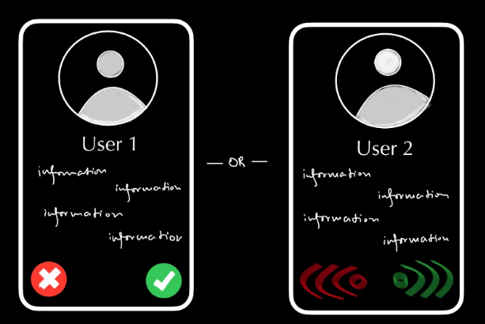
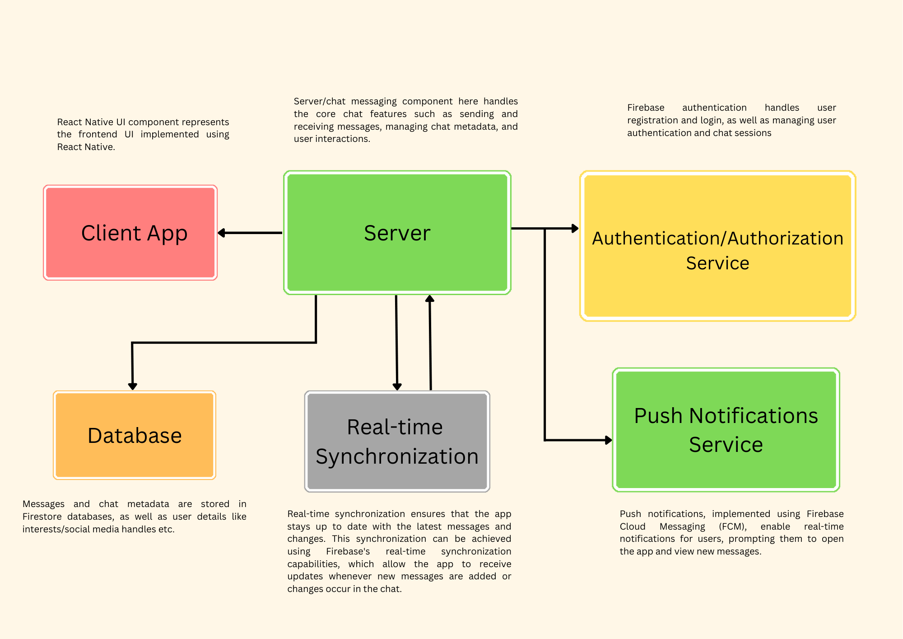

# nusorbital2023

# **Milestone 1 Submission** #

## **Team Name:** ##

*yuhSURE*

## **Proposed Level of Achievement:** ##

*Apollo*

## **Motivation:** ##

Having been international freshmen this past year, we had known the challenge to put ourselves out there, interact with people and meet new people. 

Besides, the initially advertised (in the telegram groupchats) Telegram MatchBot to interact with people matched based on our preferences and profiles proved inadequate. It was inconvenient and awkward to use besides the fact that it provided no autonomy to who we are matched with, which led to repetitive matches with the same user. 

Furthermore, one major drawback was the inability to hold multiple chats concurrently. These limitations had initially outlined the basis of our idea, ***an improved chat app***.

Besides, we realised that however easy or difficult it might prove to match, there is still a huge wall to climb in overcoming the awkwardness that comes with not knowing what to talk about. A conversation may run dry or turn awkward after a basic exchange of introductions.

Which is why we have further ideated to have features that not only serve the intended purpose of tackling limitations with pre-existing chatbots but also to further add a leisurely element to the chat app.

Additionally,we intend to understand and learn exactly how mobile app development takes place along our development process. We also intend to learn how to apply the learnt OOP principles to the project we have decided to undertake.

## **Aim:** ##

To create a chat app that allows users to first create profiles and choose varying levels of anonymity in their profiles to display to users who are ready to match after profile creation.

Secondly, we intend to add a matching interface similar to what a lot of apps already use while trying to withhold information that users choose not to publicly display. 

Thirdly, we are trying to create a chat interface which also allows multiple chats to occur concurrently similar to telegram, whatsapp and co. And furthermore, we intend to incorporate mini-games into our chat app to allow users to navigate social awkwardness and bring an element of
leisure/fun to it. 

Finally, we propose to have it support both iOS and Android.

The chat app will be primarily targeted towards university students (in this case, the sample would be NUS students). However, eventually, if everything is implemented perfectly, we intend to allow syncing of contacts in addition to email signups and allow greater depth to profile creation.

## **User Stories:** ##

* As a student who is extremely bored but can’t afford a long break, I want to be able to have a quick and random mini-game session with a kind stranger.

* As a lonely first year student who has no friends, I want to make some.

* As an incoming freshman, I want to be able to chat with a kind senior that will prime me on life in NUS before I matriculate.

* As a student who has just finished their midterms, but has friends who are still undergoing examinations, I want to meet some people and eventually hang out with them if our personalities match.

* As a final year student who struggled with being free at the same time as their friend, I want to be able to get matched with people from my major and possibly hangvout with them.

* As a first year student with plans to do Orbital, I want to look for a partner to work on an idea with.

* As a student struggling with the idea of being seen or judged, I want to keep myself anonymous and interact with people until I feel comfortable enough to reveal myself.

* As a student who has numerous doubts in CS, I want to be able to chat with a senior about them while keeping myself anonymous.

## **Features:** ##

#### E-mail Verification ####
***Proposed:***
- Signing up to the chat app would require valid e-mail IDs and to confirm the same, we intend to send verification codes to the users’ entered e-mail IDs. The database for the authentication of the e-mail IDs would be based in firebase.

***Current Progress:*** 
- Logging in and signing up have both been connected to the firebase and work completely fine, verification has been set up.

#### Profile Creation ####
***Proposed:***
- This feature is what will entail the varying levels of anonymity and the information obtained from the user.
    - In signing up, the user is prompted for some information. Some of which are intended to be kept optional while most being mandatory. Each field to be given a choice of anonymity.

    - However, it’d be disallowed to keep all fields anonymous. All information recorded will be stored in our database.

    - *Information planned to be recorded*
        - Name
        - Major
        - Year
        - On campus?
        - Age/Birthday
        - Gender
        - Cultural Identity
        - Social Media Handles

    - After information is provided the chat home screen should be prompted with options to continue current chats, match with users, or to initiate mini-games with existing users in the chat. We are using Firestore from Firebase SDK as our database.

***Current Progress***
- A Login and Sign Up interface has been set up using firebase for Email authentication.

- Verification is set up by comparing and checking with existing data on database with Firestore.

- As for the different base screens, they have all been further set up in the form of a home screen with no interactive buttons, a basic chat interface without user-to-user interaction yet and a fully interactive login and signup screen using *React Native, Expo* and their dependencies. 

- The form for the information and levels of anonymity yet to be set up.

- More comprehensive UI/UX design features are yet to be implemented.

#### Matching Interface #####
***Proposed***
- Proposing for the feature to be either be based on swiping or a simple green-button/red-button tap interface. Animations intended to be included.

***Current Progress***
- As of milestone 2, it is yet to be implemented. Currently different versions are being looked at, compared and studied. More in depth research from match interface of dating apps etc to draw as examples. *(For instance, two possible ways (button press/swipe) to implement the same are shown as in the figure below)*

#### Mini-Games Interface ####
***Proposed***
- Initially intended to have at least 3 mini-games in the form of the classics: tic-tac-toe, connect-4 and rock, paper, scissors. We are intending to build both of them in React Native itself. 

- The games are further proposed to have a points system which can be used to unlock achievements and collect more avatars to display in place of profile pictures.

- Eventually proposed to include leaderboards.

***Current Progress***
- One minigames prototype of tic tac toe have been implemented. Currently looking to make the winnings be tracked for the gamification system.

## **Architectural Diagram:** ##

## **Timeline:** ##

**Completed as of Milestone 1:**
- Basic structure of chat app *(i.e. navigation between Home and Chat screens)*
- Login and Sign-Up interface
- Connection to Firebase to authenticate E-mails

**Completed as of Milestone 2:**
- Database and signup procedure to be completed in coherence
    - i.e. recorded information by the signup to be updated in database, which includes:
        - store data in database (completed)
        - link database to signup/login screen (completed)

-Games prototype
    -simple tic tac toe game played between users completed
    -launched from chat screen

-Chat interface
    - Whatsapp style messaging with chats that remain until users are unmatched
        
**To be completed by end June:**
- Completed chat interface, i.e. implementing:
    - Notifications of incomming messages
    - Option to update information after signup (in-process)
    - Auto-login

- Matching interface, which includes:
    - Implementing swipe/choose feature
    - Display respective data for matching interface
    - Notifications for messages / upon successful matches

**To be completed by end July:** 
- Gamification system (undecided)
    - Reward users with points for winning/completing minigames
    - Avatar rewards (displayed as profile images) redeemed by collecting points from minigames
    
- User Testing
    - Planned to upload app and allow public for testing by hosting on Expo servers.

#### [Video link](https://www.clipchamp.com/watch/9tEIm2e9EsZ) for milestone 2 ####